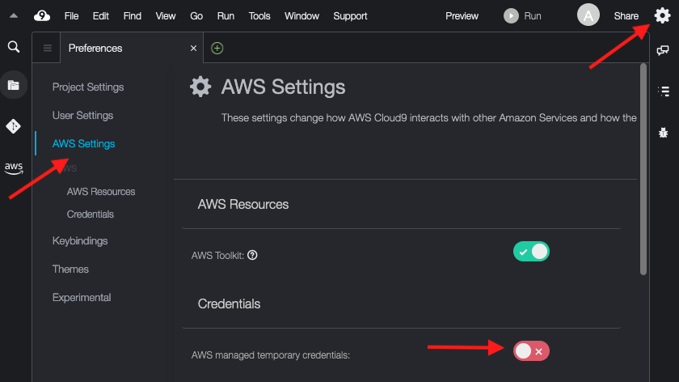
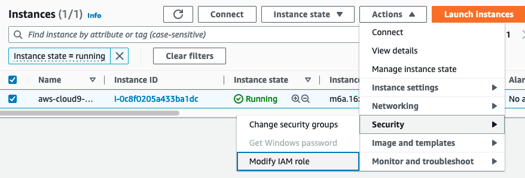
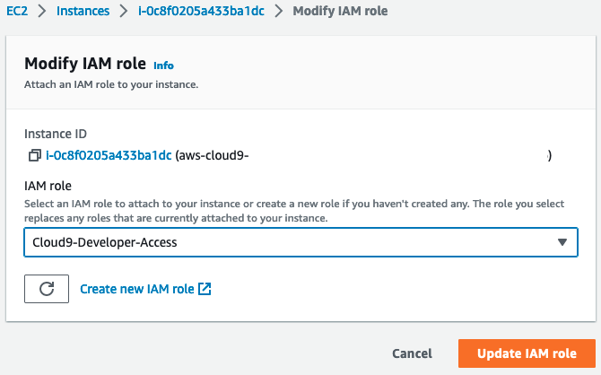

# AWS Cloud9 Setup

Most steps in this repository will need to be performed from a Linux command prompt. An especially convenient way of doing this is to use AWS Cloud9, a cloud-based Integrated Development Environment (IDE). Cloud9 allows you to edit source files and execute commands from an easy-to-use web interface. It comes pre-configured with many of the tools needed for software development, and because it runs in the AWS Cloud, it can be an especially easy way to access other cloud services. One other handy feature is that your Cloud9 instances automatically stop running after a configurable period of inactivity, which helps reduce costs.

## Create a Cloud9 environment

Navigate to the AWS Cloud9 service in your Management Console, then select Create environment. Choose any name you want. For environment type, select **New EC2 instance**. For instance type, select **Additional instance type** and choose **t3.medium**. For platform, select **Amazon Linux 2**. Leave all other settings at their default, then select **Create**.

## Create IAM Role for Cloud9 instance with AWS CLI

If you have AWS Comand Line Interface [installed and configured](https://docs.aws.amazon.com/cli/latest/userguide/cli-chap-getting-started.html) on your local machine, perform the following steps in your **local machine**. Alternatively, in some regions, you can use [AWS CloudShell](https://docs.aws.amazon.com/cloudshell/latest/userguide/welcome.html).

Create an instance profile called **Cloud9-Developer-Access**

1. Create role policy definition file

```bash
cat > ec2-trust-policy.json <<EOF
    {
    "Version": "2012-10-17",
        "Statement": [
            {
            "Effect": "Allow",
            "Principal": {
            "Service": "ec2.amazonaws.com"
            },
            "Action": "sts:AssumeRole"
            }
        ]
    }
EOF
```

2. Create new IAM role called "Cloud9-Developer-Access" and assign the new role policy

```bash
aws iam create-role \
--role-name Cloud9-Developer-Access \
--assume-role-policy-document file://ec2-trust-policy.json
```

3. Attach AWS Managed policy with AdministratorAccess to the new role

```bash
aws iam attach-role-policy \
    --role-name Cloud9-Developer-Access \
    --policy-arn arn:aws:iam::aws:policy/AdministratorAccess
```

4. Create EC2 instance profile

```bash
aws iam create-instance-profile --instance-profile-name Cloud9-Developer-Access
```

5. Add the new role to the instance profile

```bash
aws iam add-role-to-instance-profile \
    --instance-profile-name Cloud9-Developer-Access \
    --role-name Cloud9-Developer-Access
```

## Modify Cloud9 IAM role

In order to perform some operations for this workshop, it is necessary to assign an IAM machine role to your Cloud9 environment. In order for this role to take effect, it is necessary to disable Cloud9's normal management of your credentials. To do this, click the settings gear icon in the top-right corner of your Cloud9 environment. Scroll down and open the section for **AWS Settings**. Disable **AWS managed temporary credentials**. Close the preferences pane.



Now attach the machine role you created previously to your Cloud9 environment. To do this, go to the EC2 service in the AWS Management Console and select Instances on the lefthand sidebar. Check the box next to your Cloud9 instance, then select **Actions > Security > Modify IAM role**



Select the IAM role you created previously and then **Update IAM role**.



## Bootstrapping CDK

Perform the following steps in your **Cloud9 instance**

After arranging your environment windows, you'll want to install and update some utilities in your environment and set your default AWS region. If you are working in another region, substitute it for **us-east-1** in the commands below:

```bash
sudo pip install awscli --upgrade
sudo yum install -y jq
aws configure set default.region us-east-2
```

Install NodeJS v18 and set as the default version

```bash
nvm install 16
nvm use 16
nvm alias default 16
```

The AWS CDK includes the CDK Toolkit (also called the CLI), a command line tool for working with your AWS CDK apps and stacks. Install the CDK toolkit

```bash
npm install -g aws-cdk
cdk --version
```

Install [Session Manager plugin for AWS CLI](https://docs.aws.amazon.com/systems-manager/latest/userguide/session-manager-working-with-install-plugin.html)

```bash
curl "https://s3.amazonaws.com/session-manager-downloads/plugin/latest/linux_64bit/session-manager-plugin.rpm" -o "session-manager-plugin.rpm"
sudo yum install -y session-manager-plugin.rpm

```

Deploying stacks with the AWS CDK requires dedicated Amazon S3 buckets and other containers to be available to AWS CloudFormation during deployment. Creating these is called bootstrapping. To bootstrap, issue:

```bash
cdk bootstrap aws://<INSERT_YOUR_AWS_ACCOUNT_NUMBER>/<INSERT_YOUR_AWS_REGION>
```

## Clearing up and deleting AWS Cloud9

1. Delete Cloud9 instance

   Navigate to the AWS Cloud9 service in your Management Console, then select the environment you have created. On the top right, click **Delete** button and  follow the instructions.

2. Delete the instance profile and IAM role

```bash
aws iam delete-instance-profile --instance-profile-name Cloud9-Developer-Access
aws iam delete-role --role-name Cloud9-Developer-Access
```
